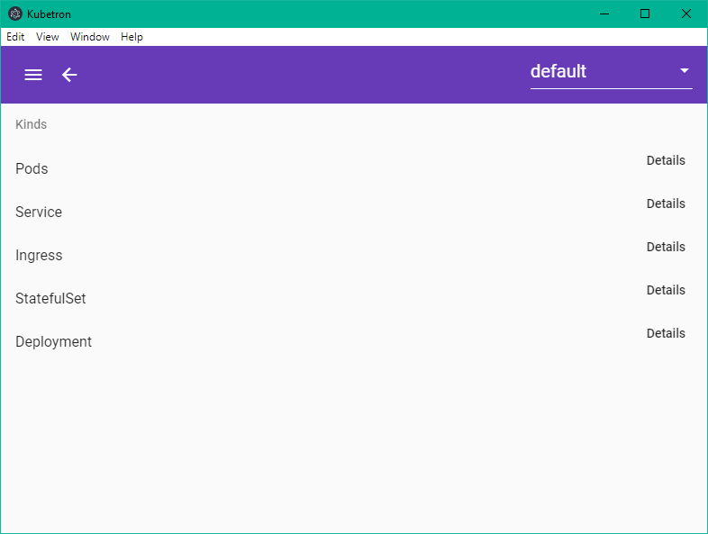

# Kubetron

## Description
The idea of kubetron is to create a cross platform stand alone k8s dashboard. The are many command line utilities but would like to bring more style with some easy of life functionality.

## Running Electron

Run `npm run electron:start` this will build the angualr front end and start the electron app.

## Angular Frontend
This project was generated with [Angular CLI](https://github.com/angular/angular-cli) version 8.3.8.

### Code scaffolding

Run `ng generate component component-name` to generate a new component. You can also use `ng generate directive|pipe|service|class|guard|interface|enum|module`.

### Build

Run `ng build` to build the project. The build artifacts will be stored in the `dist/` directory. Use the `--prod` flag for a production build.

### Running unit tests

Run `ng test` to execute the unit tests via [Karma](https://karma-runner.github.io).

### Running end-to-end tests

Run `ng e2e` to execute the end-to-end tests via [Protractor](http://www.protractortest.org/).

### Further help

To get more help on the Angular CLI use `ng help` or go check out the [Angular CLI README](https://github.com/angular/angular-cli/blob/master/README.md).

# Contributing
Fork this repo make changes in a branch in the forked repo and open a PR to merge into the main stream.
